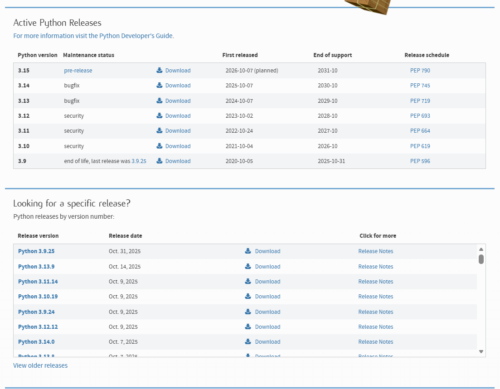
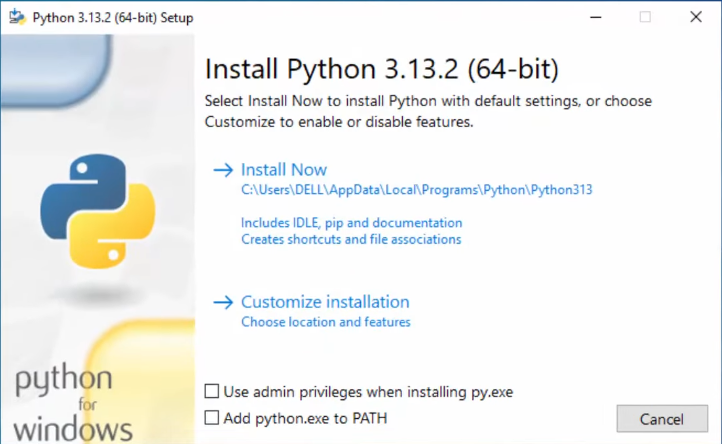

# Установка
***

**Для того, чтобы начать писать на python, нужно для начала его установить.**

**Перейдите по ссылке и скачайте сам python: [click](https://www.python.org/downloads/)  
затем можно скачать самую последнюю версию, либо ту, которая вам удобна.**

**В блоке ``Active Python Releases`` выходят самые последние версии, в нижнем блоке - ``старые``**

**После выбора версии, вас встретит вот такой блок с ссылками:**  

**Если у вас ``Windows`` - выбирайте ``Windows installer (32-bit)`` или ``Windows installer (64-bit)``**  
**После установки открываете файл, затем вас встретит такое окно:**

## Обязательно поставьте галочку в  ``Add python.exe to PATH``
[а если не поставил?](#Add-python-to-PATH)

**Затем нужно обязательно поставить галочку рядом с ``pip``**  
**остальное на ваш выбор**

***
## Console check
**хорошо, вы установили python, теперь нужно проверить, работает ли pip и сам python.**

**откройте консоль с помощью ``win+r`` → ``cmd``.  
напишите в строку ``python --version``. Консоль вывела "Python"?  
Значит вместо ``python`` пишем ``py`` → ``py --version``.  
Консоль должна вывести ``Python 3.13.2``**

### Теперь надо проверить работает ли ``pip`` [что это?](#pip)
**не выходя из консоли вводим команду ``pip``. Консоль должна вывести:**

### если вывело ``"pip" не является внутренней или внешней командой..``
**То кликаем сюда: [click](#Add-python-to-PATH)**

***
# pip
### Pip (Package Installer for Python) — стандартный пакетный менеджер для Python, с помощью которого разработчики устанавливают, обновляют и удаляют сторонние библиотеки  
### Проще говоря - это как Google Play для Python, но только в консоли.

***

## Add python to PATH
**Открывайте проводник, затем зайдите в директорию с диском на который вы устанавливали Python**  
**Затем в поиске пишем ``pip`` и ищем ``pip.exe``. Теперь кликаем правой кнопкой мыши по файлу и перемещаемся в директорию в которой он лежит**  
**Теперь копируем путь директории в которой лежит наш ``pip.exe``. путь обычно такой:**  
``C:\Users\Имя_Пользователя\PycharmProjects\PythonProject\.venv\Scripts``

**Окей, половина пути сделано. теперь открываем настройки (win + i) → Система → О системе → Доп. Параметры системы**

**В Доп.Параметрах над кнопкой "Отмена" будет кнопка ``Переменные среды``**

**теперь все сохраняем и открываем консоль (win + r), затем выполняем [Проверку](#Console-check)**

[назад](Guide/README.md)

